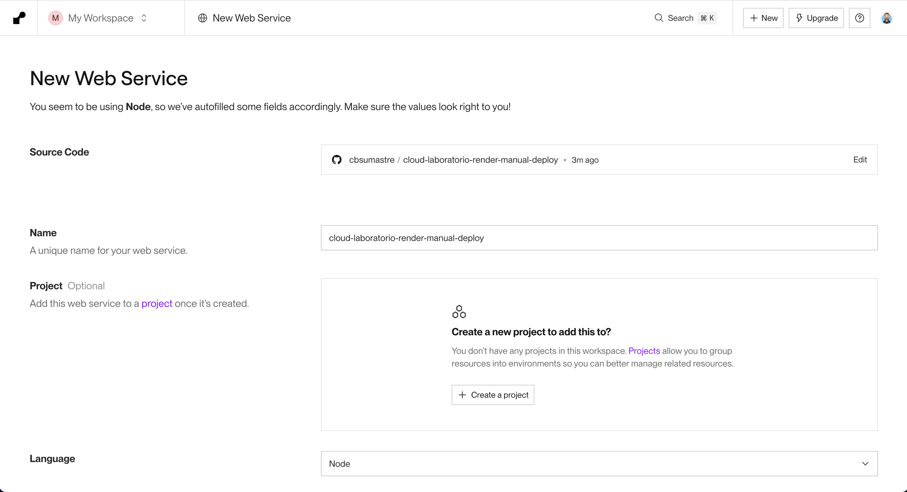
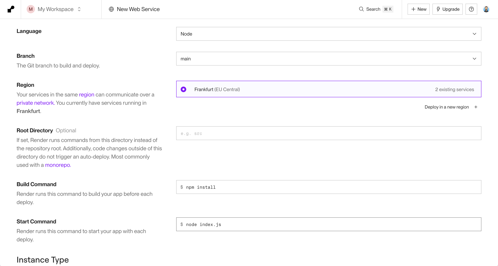
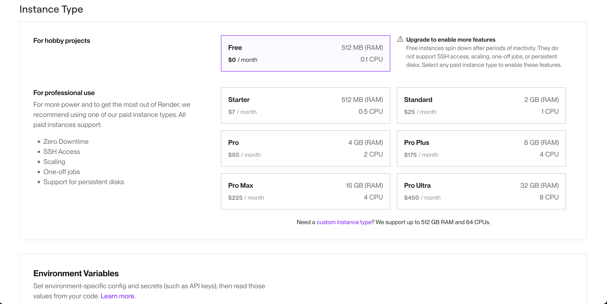

# Master Front End XVII - Módulo 7 - Cloud - Laboratorio

## Modulo Cloud - Laboratorio

### Opcional

Desplegar la app en Render, usando despliegue manual. El uso en Render será de _Web Service_

### Para poder desplegar manualmente en Render:

- Crear servidor (con express)

```bash
mkdir server
cd server
npm init -y
npm install express --save
```

- Crear fichero index.js dentro de server

```js
import express from 'express'
import path from 'node:path'

const app = express()
const staticFilesPath = path.resolve(process.cwd(), './app')
app.use('/', express.static(staticFilesPath))

app.get(/(.*)/, (_req, res) => {
  res.sendFile(path.resolve(staticFilesPath, 'index.html'))
})

const PORT = process.env.PORT || 8081
app.listen(PORT, () => {
  console.log(`App running on http://localhost:${PORT}`)
})
```

- Hacer la build

- Crear una carpeta **server/app** y copiar los fichero estáticos de **dist** dentro de la carpeta **server/app**

- Crear un nuevo repositorio (privado) para realizar el despliegue a Render desde el mismo

- Copiar todos los ficheros de server en el nuevo repositorio

- Dar acceso a Render al nuevo repositorio de Github.

- Configurar el proyecto en Render




